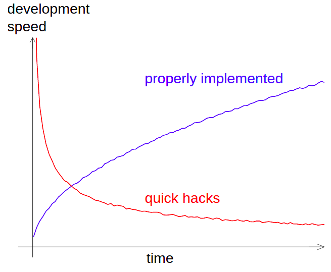
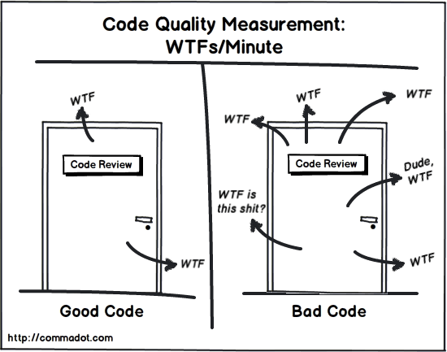

<!-- _class: title --> 
# "Free" tricks to make good *enough* software 

## 

####
##### 
#### 
**Sunniva Indrehus**
**Scientific developer**


<!-- Write some invisible text -->
<!-- ## <span style="color:#F5F5F5">What is a good *enough* code model?</span> -->


--- 


<!-- _class: split-text-image -->

<!-- _footer: " [1] Wilson, Greg, et al. 'Good enough practices in scientific computing.' PLoS computational biology 13.6 (2017): e1005510." -->

# We do good *enough*<sup>[1]</sup> 

<div class=ldiv>

##

A model of a horse

*Credit:* [Ali Bati](http://www.alibati.com/horse)


</div> 


<div class=rdiv>

## 

Development speed vs. time 
 
*Credit:* Radovan Bast


</div> 

---
<!-- 
<!-- paginate: true -->

<!-- _footer: "  *Figure credit: [Ali Bati](http://www.alibati.com/horse)* " 

# What is a good *enough* scientific model?


- Use something simplified to learn about the real world 


 
 
 --- 
-->

<!-- 

# What is a good *enough* code?


- Use something simplified **to write a simplified code** to learn something about the real world 


 
 


---  -->


# What is good *enough* code?

<!-- _class: split-text-image -->

<div class=ldiv>


</div>

<div class=rdiv>

 
 


</div>


---


# What is good *enough*  code?

<!-- _class: split-text-image -->

<!-- _footer: "&nbsp; &nbsp; &nbsp; &nbsp; &nbsp; &nbsp; &nbsp; &nbsp;&nbsp; &nbsp; &nbsp; [1] Neural Information Processing Systems: [The Machine Learning Reproducibility Checklist](https://www.cs.mcgill.ca/~jpineau/ReproducibilityChecklist.pdf), retrieved: 11.29, 25th of Febrauary 2022.<br/>
  [2] Common estimate: annually spending 20% of the development time for maintenance work" -->

<div class=ldiv>

## Some thoughts 

- Something that works 
- Standardized 
- Understandable 
- Reproducable<sup>[1]</sup> 
- Maintainable<sup>[2]</sup> 

</div>

<div class=rdiv>

 
 


</div>


--- 


# How to write code that

<!-- _class: split-text-image -->


<div class=ldiv>

## Gives you ....

- Something that works 
- Standardized 
- Understandable 
- Reproducable
- Maintainable

##  <span style="color:#F5F5F5">What is a good *enough* code model?</span> &emsp; ......?

</div>

<div class=rdiv>

 
 
 
</div>

--- 

> Know the rules so you know how to break them efficiently - Daila Lama

--- 


#   Python 


<!-- _class: split-text-image -->


<div class=ldiv>

## 

- High level programming language 
- Dynamically typed 
  - Easy to *use and misuse*
- Current version (7.12.22): 3.11.1 

<!-- 
## "free" quality code 

- Use type hints 
- (Try) to follow the Python Enhancement Proposals (PEPs)  -->


</div>

<div class=rdiv>

 
*Figure credit: [xkcd](https://xkcd.com/1987/)* 


</div>

--- 


```powershell
Python 3.11.0 (main, Nov 16 2022, 11:26:09) [GCC 9.3.0] on linux
>>> import this
The Zen of Python, by Tim Peters
Beautiful is better than ugly.
Explicit is better than implicit.
Simple is better than complex.
Complex is better than complicated.
Flat is better than nested.
Sparse is better than dense.
Readability counts.
Special cases aren't special enough to break the rules.
Although practicality beats purity.
Errors should never pass silently.
Unless explicitly silenced.
In the face of ambiguity, refuse the temptation to guess.
There should be one-- and preferably only one --obvious way to do it.
Although that way may not be obvious at first unless you're Dutch.
Now is better than never.
Although never is often better than *right* now.
If the implementation is hard to explain, it's a bad idea.
If the implementation is easy to explain, it may be a good idea.
Namespaces are one honking great idea -- let's do more of those!
```


--- 


<!-- _class: split-text-image -->

# The PEPs

<div class=ldiv>

A Python Enhancement Proposal [(PEP)](https://peps.python.org/pep-0000/) is a design document for python code

## Why should **you** care about the PEPs?
<span style="color:#F5F5F5">
- *Code is read more often then it is written* - Guido Van Rossum 
- Standardization 
- Automation 
</span>
</div>

<div class=rdiv>

<!--  
*Image credit: [xkcd](https://xkcd.com/2347/)* -->


</div>

---

<!-- _class: split-text-image -->

# The PEPs

<div class=ldiv>

A Python Enhancement Proposal [(PEP)](https://peps.python.org/pep-0000/) is a design document for python code

## Why should **you** care about the PEPs?
- *Code is read more often then it is written* - Guido Van Rossum 
- Standardization 
- Automation   

</div> 


<div class=rdiv>

 
*Image credit: [xkcd](https://xkcd.com/2347/)*


</div>

---


<!-- _class: split-text -->


# Our best PEP friends 


<div class=ldiv>


## [PEP 484](https://peps.python.org/pep-0484/)


- Type annotation 
  - Released 2015-09-13  
- Tool 
  - [mypy](https://mypy.readthedocs.io/en/stable/)

</div> 


<div class=rdiv>

## [PEP 8](https://peps.python.org/pep-0008/)

- Style guide for Python Code 
  - Released 2013-08-01  
- Tool 
  - [black](https://black.readthedocs.io/en/stable/)
  - [flake8](https://flake8.pycqa.org/en/latest/)
  - [isort](https://pycqa.github.io/isort/)

</div>


--- 

# Type hints 

```python
# this file is named factorial.py
def factorial(n):
    if n < 2:
        return 1
    return n * factorial(n - 1)

print(f"value is: {factorial(4)}")
print(f"value is: {factorial('4')}")
```


```python
(pre-commits-python-example-py3.11):~/good-scientific-software-for-free-python-demo(main)$ python factorial.py
value is: 24
Traceback (most recent call last):
  File "/home/sunnivin/NGI/slides/good-scientific-software-for-free/good-scientific-software-for-free-python-demo/factorial.py", line 14, in <module>
    print(f"value is: {factorial('4')}")
                       ^^^^^^^^^^^^^^
  File "/home/sunnivin/NGI/slides/good-scientific-software-for-free/good-scientific-software-for-free-python-demo/factorial.py", line 8, in factorial
    if n < 2:
       ^^^^^
TypeError: '<' not supported between instances of 'str' and 'int'
```

--- 

# Type hints 

Update function to include type hints 
```python 
# this file is named factorial.py
def factorial(n: int ) -> int:
    if n < 2:
        return 1
    return n * factorial_int(n - 1)


print(f"value is: {factorial(4)}")
print(f"value is: {factorial(4.5)}")
```

Output 

```powershell
(pre-commits-python-example-py3.11):~/good-scientific-software-for-free-python-demo(main)$ python factorial.py
value is: 24
value is: 39.375
```
--- 

<!-- _footer: "&nbsp; &nbsp; &nbsp; &nbsp; &nbsp; &nbsp; &nbsp; &nbsp; &nbsp; &nbsp; &nbsp;  <br/>
 [1] Actually agreeable with [Pydantic](https://pydantic-docs.helpmanual.io/), [Pandera](https://pandera.readthedocs.io/en/stable/), retrieved: 15.11, 30th of November 2022 :heart_eyes:"  -->

# Type hints 

## Was this pythonically correct? 


```powershell
(pre-commits-python-example-py3.11):~/good-scientific-software-for-free-python-demo(main)$ python factorial.py
value is: 24
😱 value is: 39.375 😱
```

Check with `mypy` 
```powershell
(pre-commits-python-example-py3.11):~/good-scientific-software-for-free-python-demo(main)$ mypy factorial.py
factorial.py:14: error: Argument 1 to "factorial" has incompatible type "float"; expected "int"  [arg-type]
Found 1 error in 1 file (checked 1 source file)
```


:scream: what about data and type hints<sup>[1]</sup>? :scream:


--- 


# Style guide

## [Indentation](https://peps.python.org/pep-0008/#indentation)

> Use 4 spaces per indentation level. 
>

```python 
# Correct: aligned with opening delimiter.
foo = long_function_name(var_one, var_two,
                         var_three, var_four)

# Wrong: arguments on first line forbidden when not using vertical alignment.
foo = long_function_name(var_one, var_two,
    var_three, var_four)
```

--- 

# Style guide 

## [Names to avoid](https://peps.python.org/pep-0008/#names-to-avoid)
> Never use the characters ‘l’ (lowercase letter el), ‘O’ (uppercase letter > oh), or ‘I’ (uppercase letter eye) as single character variable names.
> In some fonts, these characters are indistinguishable from the numerals one and zero. When tempted to use ‘l’, use ‘L’ instead.
> 

```python 
l : string = "my_string"
1 : float = 4.5
```


--- 


# Style guide  
The following code can run correctly, but is not correctly formatted according to PEP8

```python 
# this file is named factorial.py
from pathlib import Path
import math 

l = 42 
def factorial(
    n: int) -> int        :
    if n <          2:
        return 1
    return           n * factorial(n - 1)

print(f"value is: {factorial(4)}")
```


--- 


# isort 

```powershell 
(pre-commits-python-example-py3.11):~/good-scientific-software-for-free-python-demo(main)$ isort factorial.py
```


```python 
import math
from pathlib import Path

l = 42 
def factorial(
    n: int) -> int        :
    if n <          2:
        return 1
    return           n * factorial(n - 1)

print(f"value is: {factorial(4)}")
```

---

# Flake8 

```powershell 
(pre-commits-python-example-py3.11):~/good-scientific-software-for-free-python-demo(main)$ flake8 factorial.py
factorial.py:1:1: F401 'math' imported but unused
factorial.py:2:1: F401 'pathlib.Path' imported but unused
factorial.py:4:1: E741 ambiguous variable name 'l'
```


---


# Black 


```powershell 
(pre-commits-python-example-py3.11):~/good-scientific-software-for-free-python-demo(main)$ black factorial.py
reformatted factorial.py

All done! ✨ 🍰 ✨
1 file reformatted.
```

```python 
def factorial(n: int) -> int:
    if n < 2:
        return 1
    return n * factorial(n - 1)


print(f"value is: {factorial(4)}")
```
 
--- 


<!-- _class: split-text-image -->

# [Git-Hooks](https://git-scm.com/book/en/v2/Customizing-Git-Git-Hooks) 
<div class=ldiv>

## 

##


- Enforce standards 
  - `.pre-commit-config.yaml`

## 

- Action linked to a change
  - Pre-commit 
 

## 

- Local run 


</div> 


<div class=rdiv>

## 

 
*Credit: [http://memegenerator.net/](http://memegenerator.net/)*


</div>


---

# Pre-commit 

```powershell 
(pre-commits-python-example-py3.11):~/good-scientific-software-for-free-python-demo(main)$ ls -la .git/hooks/
... 
-rwxr-xr-x 1 sunnivin sunnivin 1638 Dec  8 13:47 pre-commit.sample
... 
```

```powershell 
(pre-commits-python-example-py3.11):~/good-scientific-software-for-free-python-demo(main)$ poetry install 
(pre-commits-python-example-py3.11):~/good-scientific-software-for-free-python-demo(main)$ pre-commit install
pre-commit installed at .git/hooks/pre-commit
```


```powershell 
(pre-commits-python-example-py3.11):~/good-scientific-software-for-free-python-demo(main)$ ls -la .git/hooks/
...
-rwxr-xr-x 1 sunnivin sunnivin  678 Dec  8 13:59 pre-commit
-rwxr-xr-x 1 sunnivin sunnivin 1638 Dec  8 13:47 pre-commit.sample
...
```
--- 

# Pre-commit 

```powershell 
(pre-commits-python-example-py3.11):~/good-scientific-software-for-free-python-demo(main)$ git add . 
(pre-commits-python-example-py3.11):~/good-scientific-software-for-free-python-demo(main)$ git commit -m "doc: enforcing PEP8" 
...
Fixing factorial.py
Mixed line ending........................................................Passed
mypy.....................................................................Passed
seed isort known_third_party.............................................Passed
isort....................................................................Passed
black....................................................................Failed
- hook id: black
- files were modified by this hook
reformatted factorial.py
All done! ✨ 🍰 ✨
1 file reformatted.
pyupgrade................................................................Passed
blacken-docs.............................................................Passed
flake8...................................................................Failed
- hook id: flake8
- exit code: 1
factorial.py:1:1: F401 'math' imported but unused
factorial.py:2:1: F401 'pathlib.Path' imported but unused
factorial.py:4:1: E741 ambiguous variable name 'l'
...
```


--- 


# Pre-commit 

My code is updated 
```python
# this file is called factorial.py
l = 42


def factorial(n: int) -> int:
    if n < 2:
        return 1
    return n * factorial(n - 1)


print(f"value is: {factorial(4)}")
```


--- 

# Pre-commit with automatic formatting  

[Demo repository](https://github.com/sunnivin/good-scientific-software-for-free-python-demo) 

--- 

<!-- 
<!-- _class: split-text-image -->
<!-- 
# The *zen* of scientific programming 

<div class=ldiv>

##


## 

##


- Find the right tool for the right job


</div> 


<div class=rdiv>

## 

 
*Credit: Radovan Bast*


</div> -->

 
# :pray: Credit for this talk :pray: 

- [Modular code development](http://cicero.xyz/v3/remark/0.14.0/github.com/coderefinery/modular-code-development/master/talk.md) by Radovan Bast
- [Factorial](https://en.wikipedia.org/wiki/Factorial)
- [Life is better painted black, or: How to Stop Worrying and Embrace Auto-Formatting](https://www.youtube.com/watch?v=esZLCuWs_2Y), Lukasz Langa, PyCon2019


